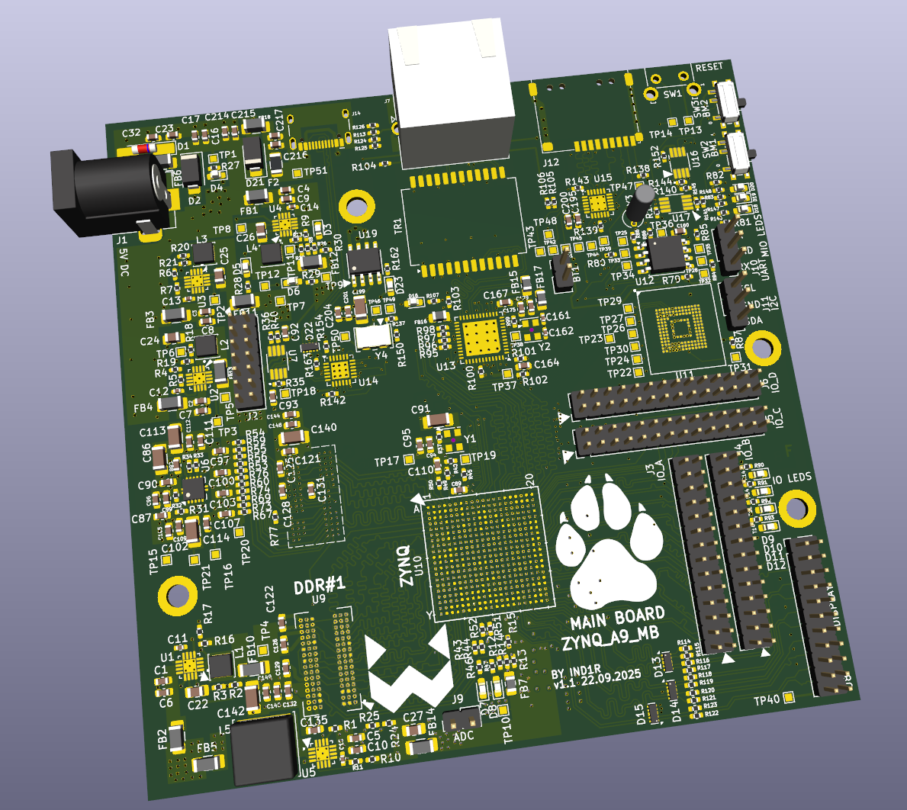
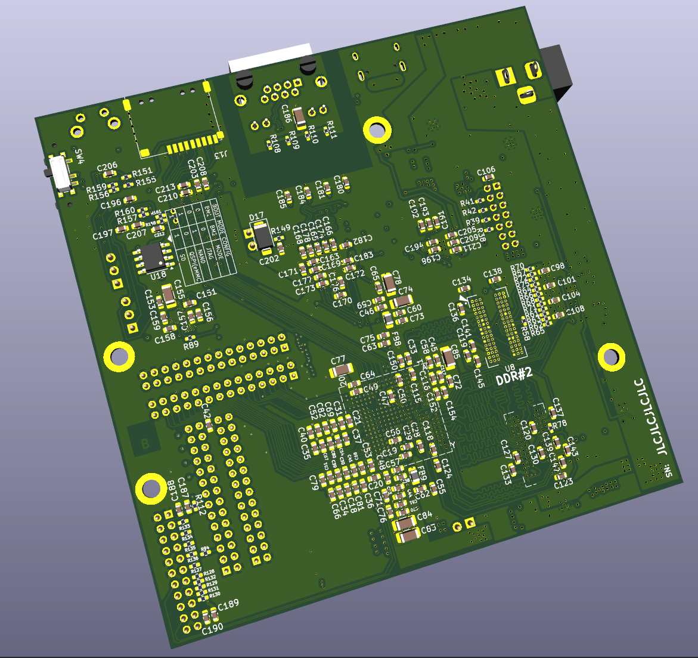

# A motherboard/test/dev board based on Xilinx 7Z010 and components from Antminer S9 control board

## Hardware:

### Features:
- Most expensive components can be salvaged from dirt cheap miner boards
- 6-layer pcb, moderately cheap to manufacture with JLCPCB, achieved by using Via In Pad technology
- Full 512MB two-chip DDR3 support
- Peripheral interfaces available on MIO pins: USB(Device/OTG), Gigabit ethernet, SD card(two switchable slots), eMMC+QSPI as boot media, I2C, UART, DS1307 RTC, XADC direct input
- Dedicated PL display header with 5 LVDS pairs, 5v/3.3v power lines, I2C and two GPIOs. Designed to be directly connectable to HDMI or MIPI DSI connector with simple extension board
- 10 matched length differential pairs available on PL_IO_A
- 22 matched length single ended CMOS lines available on PL_IO_B
- 44(+2 on PL_IO_A) general purpose CMOS lines available on PL_IO_C and PL_IO_D, effectively utilizing all 34 and 35 FPGA banks

PDF schematic is available at [hardware/schematic.pdf](hardware/schematic.pdf)

### To order from JLCPCB

Use file [hardware/gerbers/zynq_test.zip](hardware/gerbers/zynq_test.zip) and next PCB configuration:

- Layers: 6
- Dimensions: 99.5x100mm(auto derived from gerbers)
- PCB thickness: 1.2mm
- Material: FR4 TG135
- Surface finish: ENIG
- Outer copper weight: 1oz
- Inner copper weight: 0.5oz
- Stackup: JLC06121H-3313
- Impedance control: not required
- Via covering: Epoxy filled&Capped OR Copper paste filled&Capped (IMPORTANT!!!)
- Min via hole size/diameter: 0.3(0.4/0.45)mm
- PCB mark: Order number(specify position)

### Assemblying

TODO

## Software

TODO
