# A motherboard/test/dev board based on Xilinx 7Z010 and components from Antminer S9 control board

# !!!Before ordering the boards or any components, please read the entire readme, and all "Requirements" sections!!!

## Hardware:

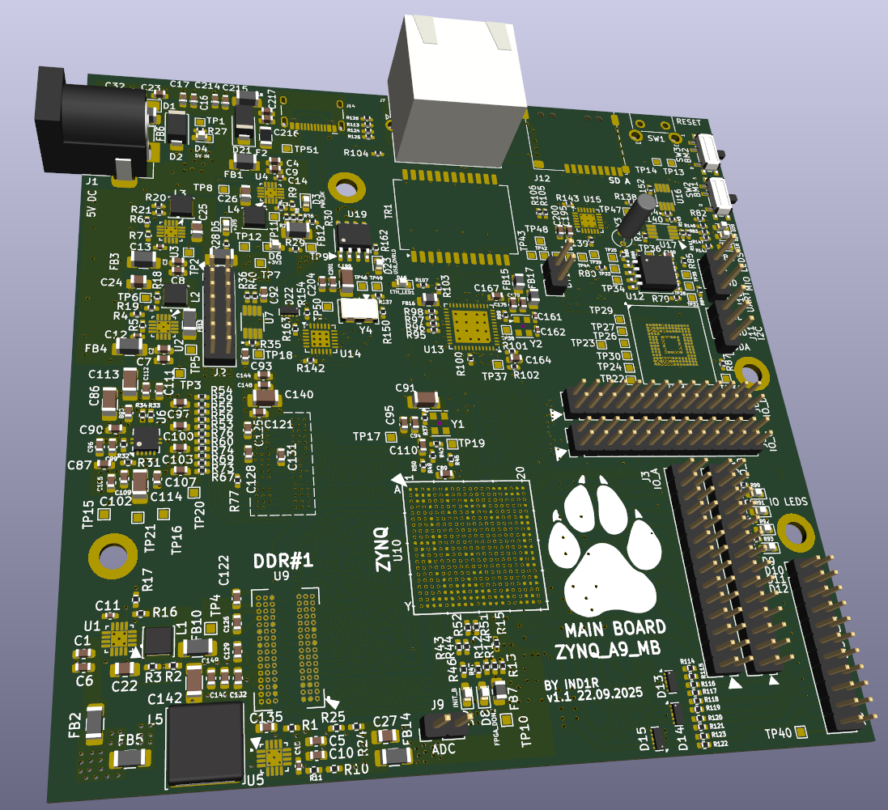


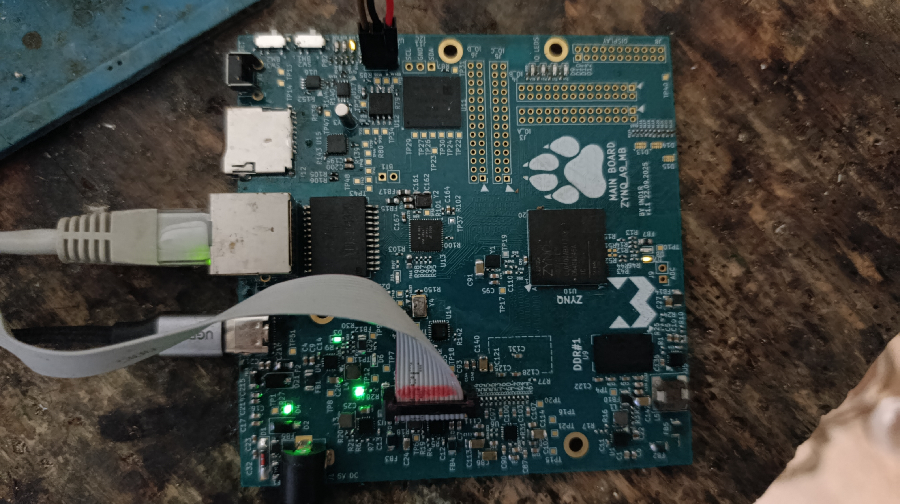
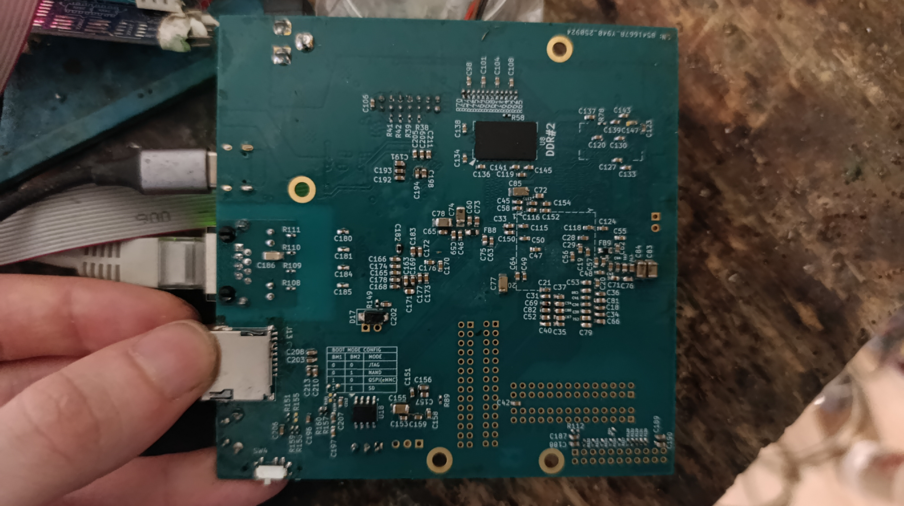

### Features:
- Most expensive components can be salvaged from dirt cheap miner boards
- 6-layer pcb, moderately cheap to manufacture with JLCPCB, achieved by using Via In Pad technology
- Full 512MB two-chip DDR3 support
- Peripheral interfaces available on MIO pins: USB(Device/OTG), Gigabit ethernet, SD card(two switchable slots), eMMC+QSPI as boot media, I2C, UART, DS1307 RTC, XADC direct input
- Dedicated PL display header with 5 LVDS pairs, 5v/3.3v power lines, I2C and two GPIOs. Designed to be directly connectable to HDMI or MIPI DSI connector with simple extension board
- 10 matched length differential pairs available on PL_IO_A
- 22 matched length single ended CMOS lines available on PL_IO_B
- 44(+2 on PL_IO_A) general purpose CMOS lines available on PL_IO_C and PL_IO_D, effectively utilizing all 34 and 35 FPGA banks

PDF schematic is available at [hardware/schematic.pdf](hardware/schematic.pdf)

Component list(BOM) is available at [hardware/zynq_test_components_1.2.ods](hardware/zynq_test_components_1.2.ods). Values that are present on Antminer board, but not in enough count for new board, marked with red. Values that are not present on Antminer board are marked with yellow. Any component on Antminer board from column "Antminer S9 Board Reference" could be soldered to any position from column "Reference" to the new board.

### To order from JLCPCB

Use file [hardware/gerbers/zynq_test.zip](hardware/gerbers/zynq_test.zip) and next PCB configuration:

- Layers: 6
- Dimensions: 99.5x100mm(auto derived from gerbers)
- PCB thickness: 1.2mm
- Material: FR4 TG135
- Surface finish: ENIG
- Outer copper weight: 1oz
- Inner copper weight: 0.5oz
- Stackup: JLC06121H-3313
- Impedance control: not required
- Via covering: Epoxy filled&Capped OR Copper paste filled&Capped (IMPORTANT!!!)
- Min via hole size/diameter: 0.3(0.4/0.45)mm
- PCB mark: Order number(specify position)

### Assembling requirements:

- PCBs themselves, ordered earlier
- A working Antminer S9 board
- Bunch of components that are not present on the miner board(in [hardware/zynq_test_components_1.2.ods](hardware/zynq_test_components_1.2.ods) marked with yellow - not present at all, and red - present, but not enough). Some components(U11,eMMC chip), can be changed to anything that is pin compatible to the specified part and has same electrical interface(so you can put bigger or smaller eMMC if needed). Also, if you don't need some of the functionality(e.g. eMMC, USB or RTC), you can just ignore the chip associated with it and all it's surroundings. Pay attention to the component footprints/cases when ordering - they are specified in separate column.
- Soldering iron and hot air rework station.
- Something as the bottom header for the boards - specialized tool is preferred, but just iron should work as well.
- Flux, suitable for SMD and BGA soldering(i use RMA218)
- Tools for reballing - special stand with spring holder for the chip, 0.8mm spacing;0.5mm ball stencil for Zynq and DDR chips, 0.5mm spacing;0.3mm ball stencil - in case you will need to reball the eMMC, bunch of 0.45mm and 0.3mm balls(yes, you want the 0.45mm ones for zynq and ddr, because they are much easier to work with when using cheap chinese 0.5mm stencils).
- Some basic electronic skills and debugging tools - multimeter, lab power supply. Oscilloscope would be very helpful.

### Assembling

0. Before disassembling the Antminer S9 board, first power it up with 12V DC and connect via UART to check if it's working, and more importantly, copy the MAC address to use later. To do that, wait until the linux kernel is loaded, and search for the lines        like 

    "Dumping data starting at 0x01060000 and ending at 0x01060001..."   and

    "[    4.367100] bcm54xx_config_init"

    Somewhere near them will be a string with board's MAC address. Or you can just look it up at the router's DHCP client list. Store that and keep for later. Power down the board and prepare for disassembly.

1. Removing the main components from the board.

    For that you will need a bottom heater(at least something like an iron) and hot air reflow station.

    First, desolder the C88 and C58 from the bottom side of the board(don't trow them out!), and remove the black rubber box as well as everything that lift the board significantly over the surface or could be melted.

    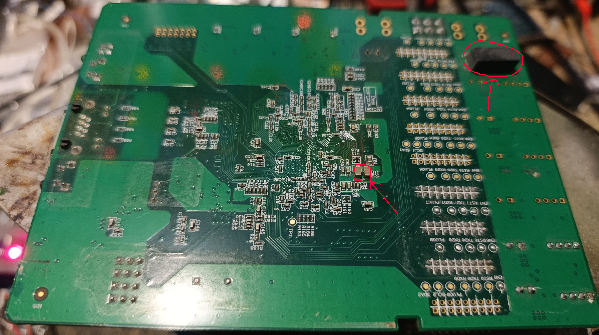

    Then, turn the board back and put it on a bottom heater's surface. At this stage we will be desoldering all needed ICs and other big SMD components from it.

    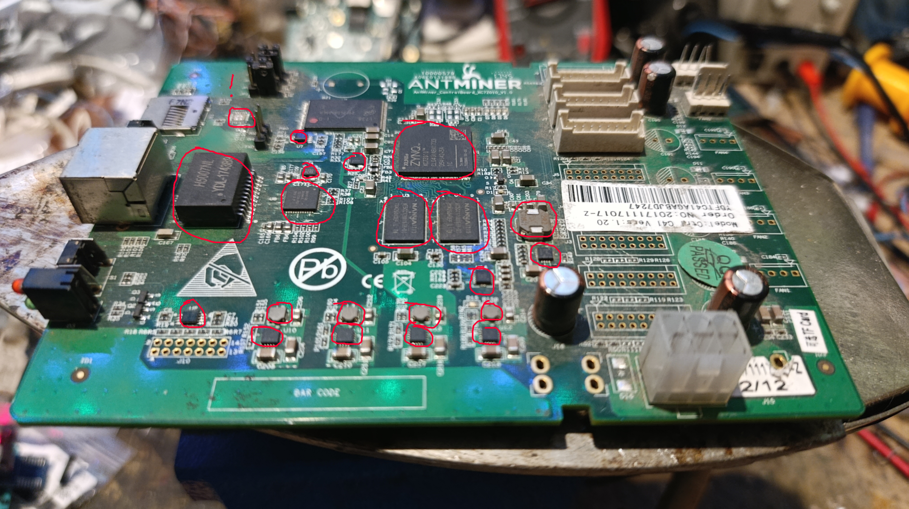

    ! Some boards lack the U6 SD card level converter. In that case, to get working SD cards on the new board, you will need to get that IC from other board, or buy a new chip.

    Finally, we can start the disassembly. Put a decent amount of flux around each of the components to be removed, and turn on the bottom heater. Wait until the PCB and big chips firmly heat up to around 150-160 dgr.C, when the flux starts to become liquid, but not vaporizing yet. After that, turn on the hot air, setting the temp to the value around 400-450 dgr.C (the PCB has very big thermal mass, so it's way easier to damage the ICs mechanically because of solder underheat, than by overheating them, but still - be careful). One by one, heat chips up until the solder is melted and take them off from the board. Pay special attention to BGA chips - balls under them should be *all* fluid enough so that entire chip is freely floating under the touch. It's *very* easy to damage it during the lift up, just bending the case too much with force.

    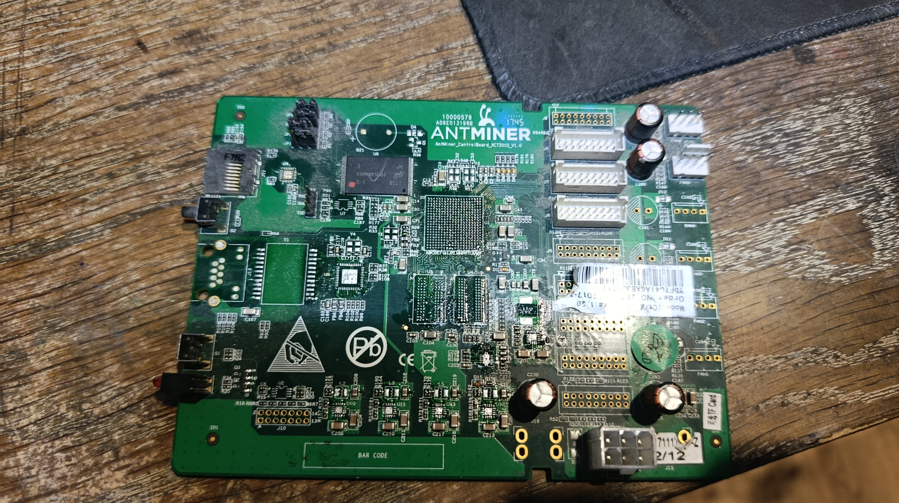

    While the board is still hot, also carefully remove the RJ45 connector, adding leaded solder to it's pins beforehand.

    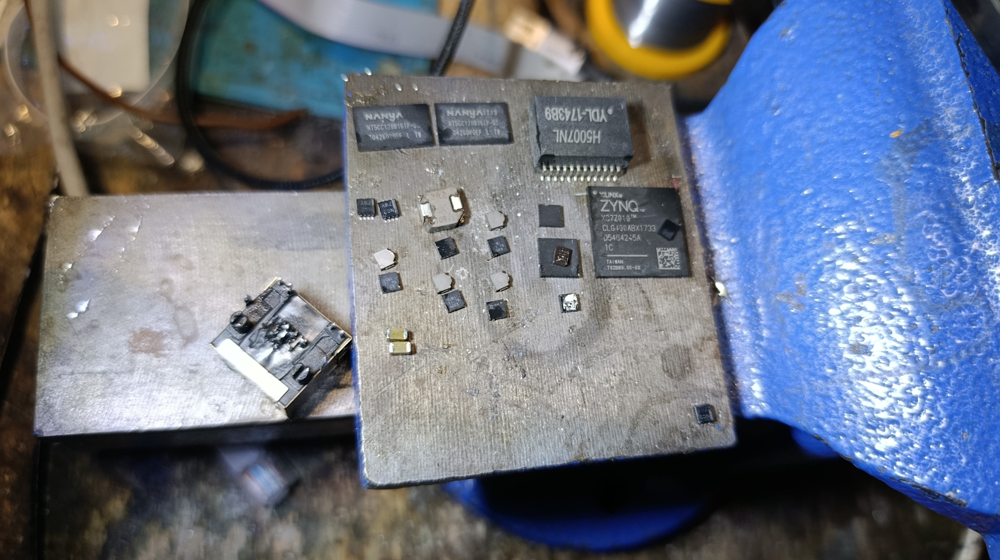

    The one LSF0102DCTR at the bottom right is an extra IC, and you need to get it either from another board or buy a new one.

2. Preparing&reballing chips

    This is one of the hardest steps. Depending on result's quality, board can work strange or don't work at all.

    First, cover all removed ICs pads with a thin equal layer of leaded solder, cleaning extra when needed. Remove the flux.

    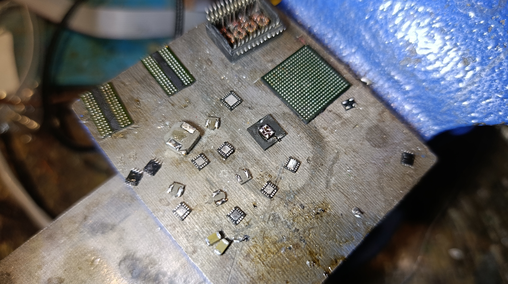

    Additionaly, rub BGA ICs against paper(not sandpaper!!) put on solid metal surface, to further increase equality of pad heights.

    Apply a thin layer of flux to the BGA chip, spreading it evenly with a blade.

    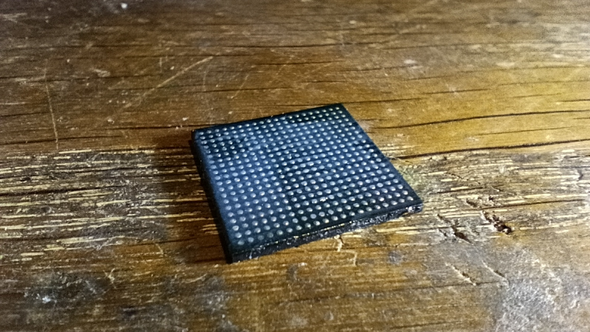

    Carefully put it on a stencil, matching pads precisely with holes in it.

    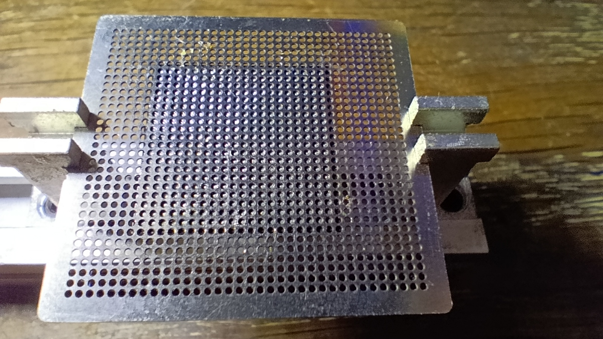

    Start pouring balls on the chip, filling each hole with one. If some of them won't fall in immediately, you can manually put them in place using tweezers

    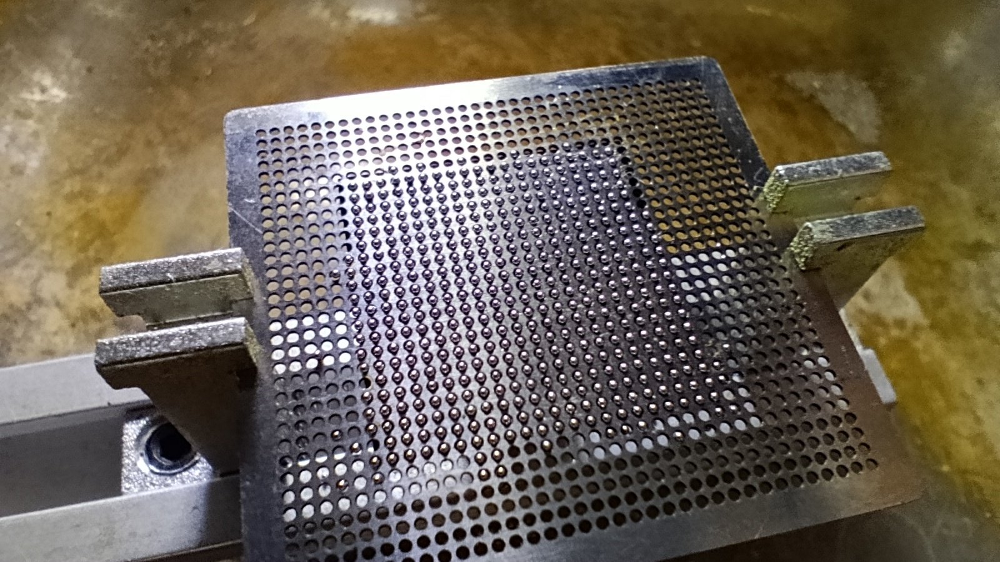

    After that, slowly heat up stencil with chip with hot air at temp around 320-350drg.C. You will see as the balls start to smelt and fall deeper in holes. If some of them stay afloat no matter the heat, you could very carefully poke them down with tweezers or other sharp tool. If they start to rapidly jump out on flux vapour, slow down the heating.

    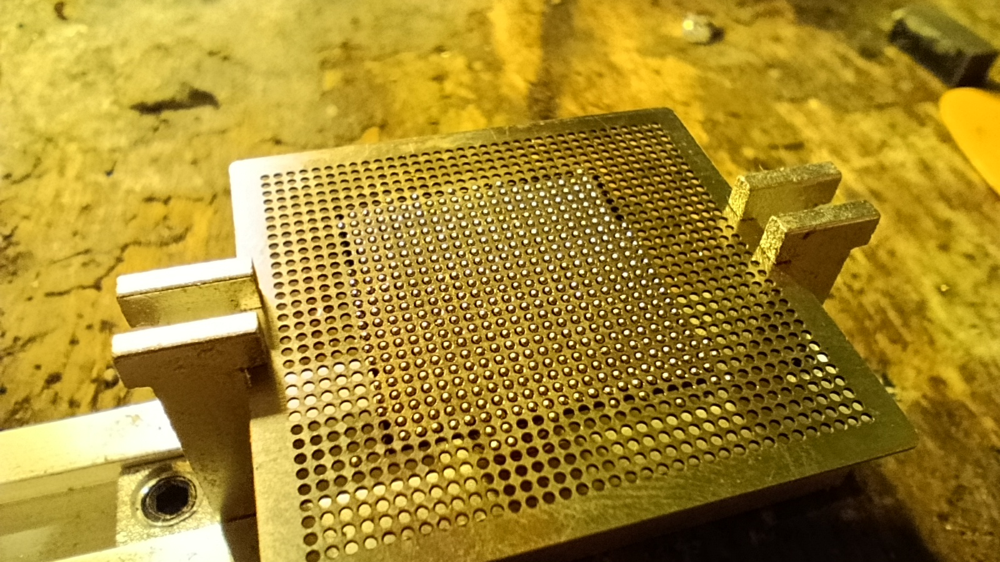

    Carefully remove IC from the stencil. If one or two balls are missing, you can gently place them manually with tweezers. Add reasonable amount of flux and slowly heat the chip again with same hot air configuration. That step is needed to fix any misalignments of stencil and pads from before.

    After melting all balls, remove the heat and let it cool. You should get a surface with almost ideally equal height balls. Remove all flux from it.

    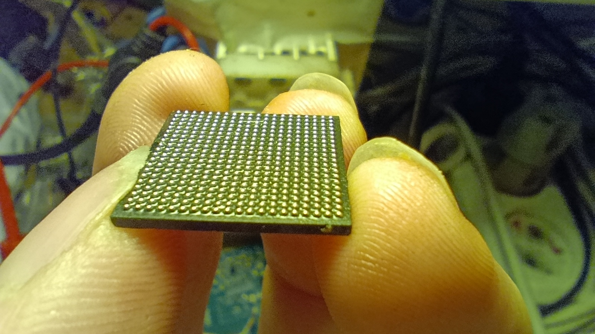

    Clean the stencil with alcohol, and repeat the process for all BGA chips.

3. Soldering in chips and big SMD components

    Take the new PCB. Put it on preheater and heat to 150-160dgr.C. Cover all needed pads with thin equal layer of solder, using soldering iron(be careful not to scratch solder mask of the traces between BGA pads). Don't forget about second DDR chip on the other side.

    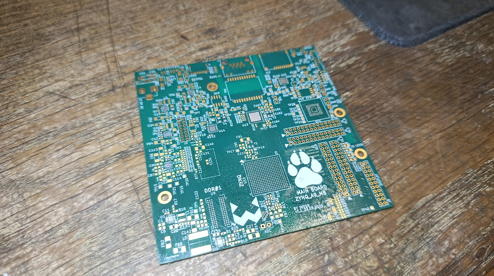
    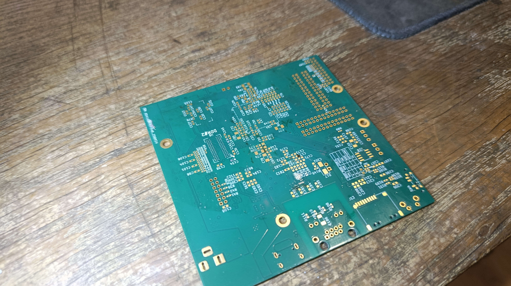

    Then, let it cool down and clean all extra flux. Apply thin amount of flux on the pads with blade as when reballing BGA.

    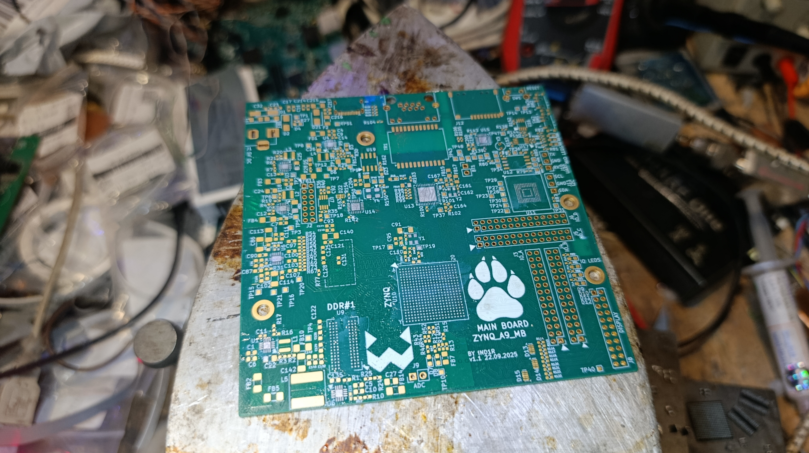

    Place all ICs, oscillators and big inductors on their respective pads EXCEPT L3,L4,L1,L5, accoring to key, as presice as possible. Place it on bottom heater again and heat up. Using hot air with temp around 350-400dgr.C, solder in everything, starting from BGA, until balls under them have fully melted.

    After that, additionally solder each side of each QFN chip using soldering iron, to make sure no pin floats in air. Check using microscope or at least magnifying glass.

    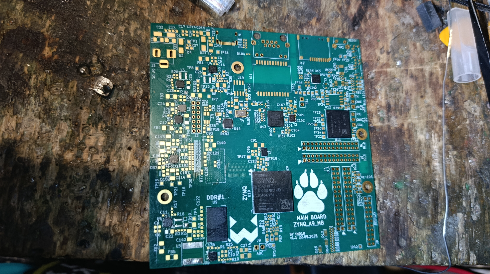

    Finally, solder in other big inductors. And SOIC ICs, using soldering iron.

    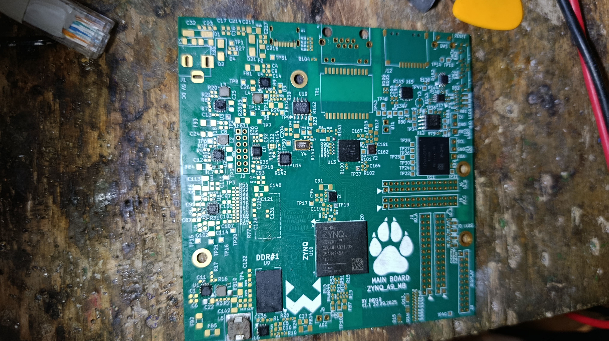
    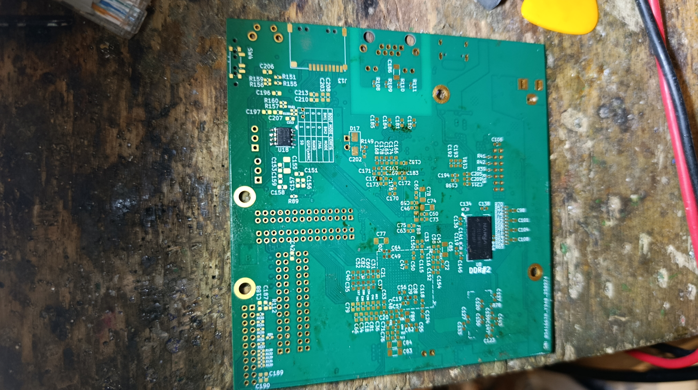


4. Assembling and testing power supplies

    It's important to do this prior to powering up entire board, because if power supplies are broken, they could easily kill FPGA or other expensive circuitry.

    You need to solder in all components under the "POWER REGULATORS" block in schematic diagram EXCEPT the FB14,FB13,FB10,FB11,FB12 to cut the power off the remaining board(open the board and schematic files at the same time, and select the entire block with mouse. You will see all required components highlighted in the board view window).

    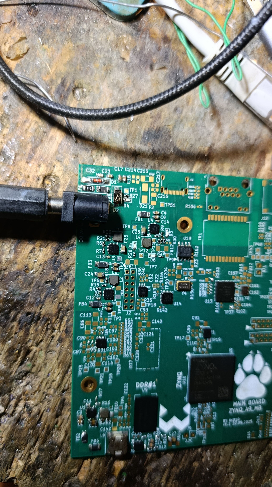

    Apply 5V to the J1 with lowest current limit possible, it should consume almost nothing(< 0.01A). D4 "5V_IN" and D3 "PWR_OK" should light on. If not, check the power good chain one by one(TP3 - 1V, TP6 - 1.5V, TP2 - 1.25V, TP8 - 2.1V, TP11 - 2.5V), likely the issue is that one of the QFN chips is soldered badly. Next, check the actual voltages on the ferrite bead points(FB14 - 1V, FB13 - 1.8V, FB10 - 1.5V, FB11 - 2.5V, FB12 - 3.3V). If all voltages are fine - the power supply is working correctly! Power off the board, solder in the remaining FB14,FB13,FB10,FB11 and FB12 and continue the building.

    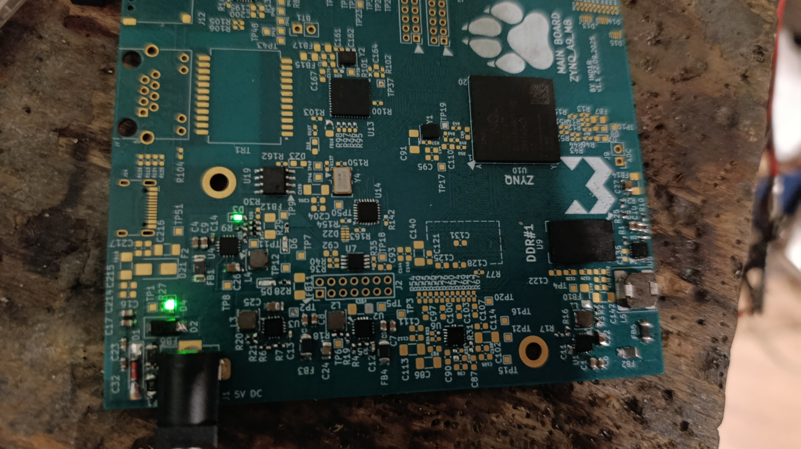

5. Completing the minimal SoC circuit

    To start up the Zynq and begin interacting with it, next components are required: "SOC POWER IN" block, "JTAG" block, "CLK" block, "FPGA STATUS LEDS" block, C89, SW1, R30, bootstrap part from "EMMC+BOOTSTRAP" block: R81,R82,R83,R84,R79,R80,R85,R86,SW2,SW3. (Also it's recommended to install Ethernet chip surrounding components to avoid burning it. I did not do that on the picture, and had to replace it later)

    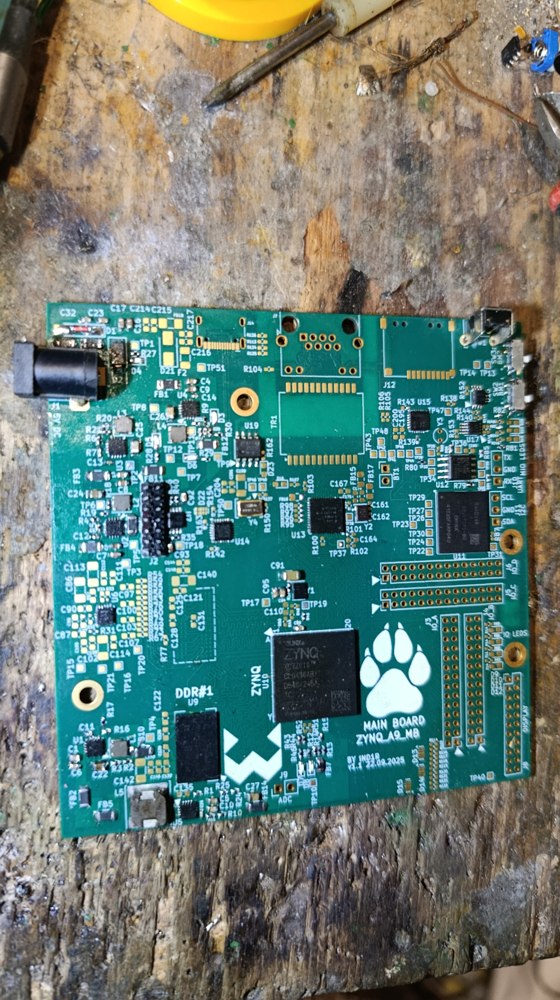
    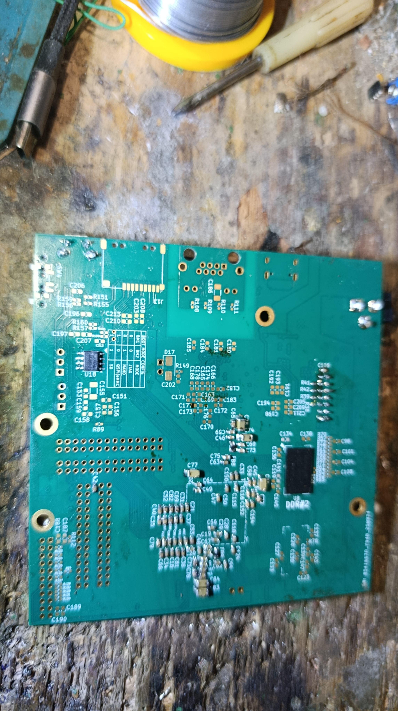

    After that, toggle BM switches to JTAG mode(BM1=0,BM2=0), connect USB Platform Cable to the board's JTAG connector, and power it up. Board should consume around 0.5A@5V at this point(later discovered that it was because of the dead Ethernet chip. Working board should use much less, around 0.17-0.22A), and yellow INIT_B LED should glow, turning off when reset button is pressed. Try connecting to it with xsdb utility(check Flashing section on how to do that). If it's detected - awesome, at least Zynq is powered properly and probably has all the important BGA pads soldered successfully! If not - first, check clock signal on TP19, then, try wiggling JTAG connector around, this helps sometimes. If that doesn't work - likely the chip is soldered badly. Put the board on preheater, CAREFULLY desolder the Zynq, reball it and try again, at some attempt it either should begin to work or you will eventually destroy the board's traces.

6. Bringing up the DDR

    Next step is soldering in all components related to DDR chips: just entire "DDR" block, and separate capacitors on the power line - C115,C116,C117,C118,C152,C154. Also you will need to solder in the UART converter to communicate with the board("UART" block, but choose only one of R151 and R155, selecting either 3.3V or 5V UART level).

    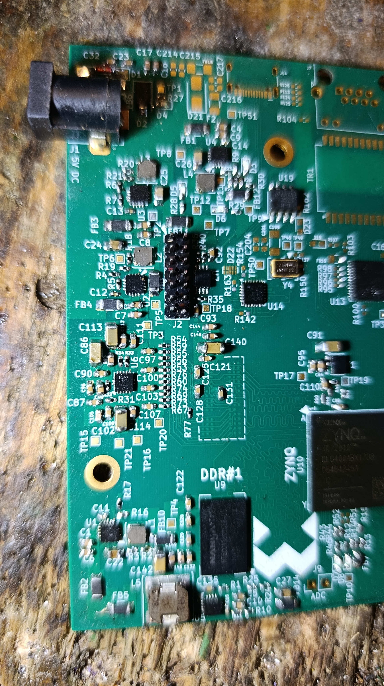
    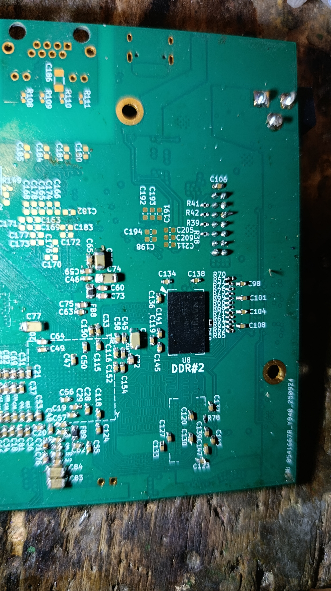

    Hook up the JTAG and UART, and power on the board. Then, load the FSBL with xsdb(more on that in Flashing section). It should load, print the voltagtes and temperatures, and stop at "Boot mode is JTAG". If it says something about DDR fault, then likely the DDR chips soldering is bad. Remove them, reball and try again. At this point it's recommended run the memtest to check memory integrity and eye opening.

    Normal values for v1.1 board are no errors on entire 511MB test, 70-80% read eye and 60-70% write eye.


7. Finishing the assembly

    At this point, you just need to solder in everything that isn't there yet. Pay special attention to R158/R161 in I2C block(it's selecting either 5V or 3.3V I2C interface, never install both at the same time). You can connect an RTC battery or ionistor to BT1 terminals if you need to keep time, but remove D17, if it's not a rechargeable one. If you don't need some of the connectors, you can also don't solder them in, or do it later. R51/R52 are not required. ESD protection diodes are not neccesary but highly recommended.

    
    

    Now, you can check all the hardware on board using u-boot to make sure everything is soldered in correctly. And finally, start to flash the firmware to SPI flash and eMMC.

## Software:


### Building requirements

Basically, a Linux machine with tools to cross-compile software for armhf arch(arm-none-eabi- compiler, binutils, etc...). At some steps, working Vivado setup is also required. ARM qemu and special binfmt software is required to get the rootfs shell and configure it on the host machine, more on that in the corresponding step.

### Building from source

Replace -j4 with the number of cores your CPU have. Pre-built binaries for each stage are present in subsequent directories, so those steps are not neccesary.

1. Building fsbl

    In software/BOOTLOADER/fsbl/src run:

    `make BOARD=a9mb CC=arm-none-eabi-gcc CFLAGS=-DFSBL_DEBUG_INFO`

    (if you need to change peripheral config, for example PL clock frequency, first export platform from Vivado, then open .xsa file with archiver and copy ps7_init.c, ps7_init.h, ps7_init_gpl.c, ps7_init_gpl.h from it to software/BOOTLOADER/fsbl/misc/a9mb)

    The built fsbl executable is software/BOOTLOADER/fsbl/src/fsbl.elf

2. Building memtest

    If you need a memtest to check the DDR, build it in software/BOOTLOADER/memtest/src with:

    `make BOARD=a9mb CC=arm-none-eabi-gcc`

    Built executable will be software/BOOTLOADER/memtest/src/memtest.elf

3. Building u-boot

    In software/BOOTLOADER/u-boot run:

    `make CROSS_COMPILE=arm-none-eabi- ARCH=arm -j4 ind1r_a9_mb_defconfig`

    `make CROSS_COMPILE=arm-none-eabi- ARCH=arm -j4`

    (if you need to change main system device tree, it's located in software/BOOTLOADER/u-boot/arch/arm/dts/ind1r-a9-mb.dts, but it's recommended to change it using dtb overlays to get more flexibility)

    u-boot executable will be software/BOOTLOADER/u-boot/u-boot.elf

4. Making binary bootloader image

    In software/BOOTLOADER run:

    `/PATH/TO/Vivado/bin/bootgen -image bootimg.bif -o boot.bin -w on`

    Resulting boot.bin file is the ready SPI flash image.

5. Making bootscript

    In software/BOOTLOADER/bootscript execute

    `./mkbootscr.sh`

6. Prepare FPGA bitstream

    Put your .bit file from Vivado(either exported or from Platform.xsa) to software/BOOTLOADER/fpga_bs, and execute

    `./bit2bin.py -f INPUT.bit PL.bin`

7. Making DT overlays

    In software/KERNEL/dtb-overlays for each overlay you want(OVERLAY_NAME.dts -> OVERLAY_NAME.dtb) run:

    `./make_overlay.sh OVERLAY_NAME`

8. Building kernel

    In software/KERNEL/linux-xlnx run:

    `make CROSS_COMPILE=arm-none-eabi- ARCH=arm -j4 ind1r_a9_mb_defconfig`

    `make CROSS_COMPILE=arm-none-eabi- ARCH=arm -j4 zImage`

    If you also need to build modules:

    `make CROSS_COMPILE=arm-none-eabi- ARCH=arm -j4 modules`

    (to use them, you'll need to install them to the ROOTFS by running

    `sudo make CROSS_COMPILE=arm-none-eabi- ARCH=arm -j4 INSTALL_MOD_PATH=../../ROOTFS/fs modules_install`

    after rootfs is initialized and set up)

    Ready kernel image is at software/KERNEL/linux-xlnx/arch/arm/boot/zImage

9. Creating rootfs

    If you want to create brand new debian rootfs, run "bootstrap.sh" script in software/ROOTFS. It will erase contents of ./fs directory and populate it with new debian system using debootstrap. Then it will run second stage using chroot, and give you the shell, so you can install and configure anything you need. Keep in mind that to do that you will need a linux system that's capable of running different architecture binaries, for example using qemu. More info on that on the internet (qemu-user-static,qemu-user-static-binfmt and qemu-system-arm).

    After finishing the configuration, run "compress.sh" from software/ROOTFS to create .tar.bz2 filesystem image. After that you can safely delete everything in ./fs directory, and later restore it using "decompress.sh ./fs" script.

    If you want to access decompressed system image shell again, just run

    `sudo chroot ./fs/ /bin/bash`

    in software/ROOTFS. Then you can change things such as root password,filesystem,install additional packages and so on. After modification, repack the image again using "compress.sh"


### Flashing requirements

- A Linux PC
- Basic experience with Linux command shell, mounting and unmounting partitions.
- Working Vivado setup with xsdb binary and hardware server
- Partition editor you're familiar with(gparted,parted,fdisk,etc)
- Platform Cable USB(Xilinx's JTAG debugger)
- Any USB-UART converter(like CH341 one) and a program to use it(like dterm)
- USB Type-C cable to connect the board to PC
- If you want to program the SPI flash separately from the board, you can as well use any programmer that works with BIOS flash ICs.

### Flashing the board

1. Interacting with the board

    After you've installed the ZYNQ and minimum required components for it to work and have working JTAG, you can start communicating with it. Just connect the Platform Cable to the JTAG connector according to key, as with any xilinx SoC board. Start the xsdb executable from Vivado bin folder and wait for it to load. After getting the command prompt, type "connect", and it will automatically start the hw server in background. Then, type "targets". For the working board, it should print:

    ```
    xsdb% targets                                                                                                                              
        2  APU                                                                                                                                   
            3  ARM Cortex-A9 MPCore #0 (Running)
            4  ARM Cortex-A9 MPCore #1 (Running)
        5  xc7z010
    ```

    If it's an error message instead, it's the problem with either Zynq, or the connection to it. To rule out connection issues, try unplugging and plugging back Platform cable(run "disconnect" command and kill all running hw_server processes in system before connecting again), wiggle the JTAG connector around and check the board power. If it still doesn't work - you likely will have to reball the SoC again.

2. Loading the FSBL

    To load FSBL through JTAG, first make sure the correct boot mode is selected with BM switches(both 0). Then, select the first CPU core:

    ```
    xsdb% targets 3
    xsdb% targets                                                                                                                                                   
        2  APU
            3* ARM Cortex-A9 MPCore #0 (Running)
            4  ARM Cortex-A9 MPCore #1 (Running)
        5  xc7z010
    ```

    Finally, run the command

    `rst; dow "/PATH/TO/zynq_a9_mb/software/BOOTLOADER/fsbl/src/fsbl.elf"; con`

    to reset anything running on CPU, upload the bootloader and start executing it.

    You will see the upload progress in xsdb window:

    ```
    xsdb% rst; dow "~/KiCad/zynq_a9_mb/software/BOOTLOADER/fsbl/src/fsbl.elf"; con                                                                                  
    Downloading Program -- /home/indir/KiCad/zynq_a9_mb/software/BOOTLOADER/fsbl/src/fsbl.elf                                                                       
        section, .text: 0x00000000 - 0x0001af6f
        section, .handoff: 0x0001af70 - 0x0001afbb
        section, .init: 0x0001afbc - 0x0001afc7
        section, .fini: 0x0001afc8 - 0x0001afd3
        section, .rodata: 0x0001afd8 - 0x0001c81b
        section, .data: 0x0001c820 - 0x0001f983
        section, .eh_frame: 0x0001f984 - 0x0001f987
        section, .mmu_tbl: 0x00020000 - 0x00023fff
        section, .ARM.exidx: 0x00024000 - 0x00024007
        section, .init_array: 0x00024008 - 0x0002400f
        section, .fini_array: 0x00024010 - 0x00024013
        section, .rsa_ac: 0x00024014 - 0x0002503f
        section, .bss: 0x00025040 - 0x0002774b
        section, .drvcfg_sec: 0x0002774c - 0x0002774f
        section, .heap: 0x00027750 - 0x0002974f
        section, .stack: 0xffff0000 - 0xffffd3ff
    100%    0MB   0.1MB/s  00:01                                                                                                                                    
    Setting PC to Program Start Address 0x00000000
    Successfully downloaded /home/indir/KiCad/zynq_a9_mb/software/BOOTLOADER/fsbl/src/fsbl.elf
    Info: ARM Cortex-A9 MPCore #0 (target 3) Running                                                                                                                
    xsdb% 
    ```

    And after that, you should see it printing a greeting to the UART:

    ```
    Xilinx First Stage Boot Loader 
    Release 2025.2	Jan  8 2026-12:48:30
    Devcfg driver initialized 
    Silicon Version 3.1
    Chip temperature: 42.941742 C
    VCCINT: 0.983643 V
    VCCAUX: 1.784180 V
    VPVN: 0.000000 V
    VREFP: 0.000000 V
    VREFN: 0.000000 V
    VBRAM: 0.983643 V
    VCCPINT: 0.977051
    VCCPAUX: 1.783447
    VCCPDRO: 1.483154
    Boot mode is JTAG
    ```

    If it's going like that, then DDR subsystem is working fine, as it does it's startup and simple check. Also it initializes other PS side peripherals. The board is ready and waiting for the next stage program now.

3. Loading the memtest

    If you want to check memory integrity or read/write eye opening, this tool does that.

    After having the FSBL successfully loaded and executed, in xsdb run

    `stop; dow "/PATH/TO/zynq_a9_mb/software/BOOTLOADER/memtest/src/memtest.elf"; con`

    It will show the progress:

    ```
    xsdb% stop; dow "~/KiCad/zynq_a9_mb/software/BOOTLOADER/memtest/src/memtest.elf"; con                                                                           
    Info: ARM Cortex-A9 MPCore #0 (target 3) Stopped at 0x1ffaf200 (Suspended)
    Downloading Program -- /home/indir/KiCad/zynq_a9_mb/software/BOOTLOADER/memtest/src/memtest.elf                                                                 
        section, .text: 0x00000000 - 0x00010acf
        section, .init: 0x00010ad0 - 0x00010adb
        section, .fini: 0x00010adc - 0x00010ae7
        section, .rodata: 0x00010ae8 - 0x00012467
        section, .data: 0x00012468 - 0x00015d8b
        section, .eh_frame: 0x00015d8c - 0x00015d8f
        section, .mmu_tbl: 0x00018000 - 0x0001bfff
        section, .ARM.exidx: 0x0001c000 - 0x0001c007
        section, .init_array: 0x0001c008 - 0x0001c00f
        section, .fini_array: 0x0001c010 - 0x0001c013
        section, .bss: 0x0001c018 - 0x0001d2df
        section, .heap: 0x0001d2e0 - 0x0001f2df
        section, .stack: 0xffff0000 - 0xffffd3ff
    100%    0MB   0.1MB/s  00:01                                                                                                                                    
    Setting PC to Program Start Address 0x00000000
    Successfully downloaded /home/indir/KiCad/zynq_a9_mb/software/BOOTLOADER/memtest/src/memtest.elf
    Info: ARM Cortex-A9 MPCore #0 (target 3) Running                                                                                                                
    xsdb% 
    ```

    And in UART terminal you will see the program prompt:

    ```
    -----------------------------------------------------------------
    ------------------- ZYNQ DRAM DIAGNOSTICS TEST ------------------
    -----------------------------------------------------------------
    Select one of the options below:
    ## Memory Test ##
    Bus Width = 32,   XADC Temperature = 66.6117
        's' - Test 1MB length from address 0x100000
        '1' - Test 32MB length from address 0x100000
        '2' - Test 64MB length from address 0x100000
        '3' - Test 128MB length from address 0x100000
        '4' - Test 255MB length from address 0x100000
        '5' - Test 511MB length from address 0x100000
        '6' - Test 1023MB length from address 0x100000
    ## Read Data Eye Measurement Test
        'r' - Measure Read Data Eye
    ## Write Data Eye Measurement Test
        'i' - Measure Write Data Eye
        Other options for Write Eye Data Test:
            'f' - Fast Mode: Toggles Fast mode - ON/OFF
            'c' - Centre Mode: Toggles Centre mode - ON/OFF
            'e' - Vary the size of memory test for Read/Write Eye Measurement tests
    ## Data Cache Enable / Disable Option:
        'z' - D-Cache Enable / Disable
    ## Other options
        'v' - Verbose Mode ON/OFF
    ```

    Options are pretty much self-explanatory. Perform all required tests and reset the board to load FSBL again. But be careful - when connected, Platform Cable can sometimes unexpectedly reset the board in the middle of RAM tests. So to be safe, after you see the prompt in the UART terminal, very carefully disconnect the JTAG cable and only then do the tests.

4. Loading the u-boot

    After FSBL was loaded and executed, run this in xsdb:

    `stop; dow "/PATH/TO/zynq_a9_mb/software/BOOTLOADER/u-boot/u-boot.elf"; con`

    As in other steps, it will print the log:

    ```
    xsdb% stop; dow "~/KiCad/zynq_a9_mb/software/BOOTLOADER/u-boot/u-boot.elf"; con                                                                                 
    Info: ARM Cortex-A9 MPCore #0 (target 3) Stopped at 0x1af90 (Suspended)
    Downloading Program -- /home/indir/KiCad/zynq_a9_mb/software/BOOTLOADER/u-boot/u-boot.elf
        section, .data: 0x04000000 - 0x040d6707
    100%    0MB   0.1MB/s  00:12                                                                                                                                    
    Setting PC to Program Start Address 0x04000000
    Successfully downloaded /home/indir/KiCad/zynq_a9_mb/software/BOOTLOADER/u-boot/u-boot.elf
    Info: ARM Cortex-A9 MPCore #0 (target 3) Running                                                                                                                
    xsdb%    
    ```

    And the loading process in UART:
    ```
    env_init: Environment SPIFlash init done (ret=0)


    U-Boot 2025.01 (Jan 08 2026 - 12:59:01 +0300)

    CPU:   Zynq 7z010
    Silicon: v3.1
    Model: ZYNQ 7z010 mainboard based on Antminer S9
    DRAM:  ECC disabled 512 MiB
    Core:  32 devices, 20 uclasses, devicetree: separate
    MMC:   mmc@e0100000: 0, mmc@e0101000: 1
    Loading Environment from SPIFlash... SF: Detected mx25l1606e with page size 256 Bytes, erase size 4 KiB, total 2 MiB
    *** Warning - bad CRC, using default environment

    In:    serial@e0001000
    Out:   serial@e0001000
    Err:   serial@e0001000
    Net:   
    ZYNQ GEM: e000b000, mdio bus e000b000, phyaddr 1, interface rgmii-id

    Warning: ethernet@e000b000 (eth0) using random MAC address - 82:e2:a3:2c:f7:eb
    eth0: ethernet@e000b000
    a9mb >
    ```

5. Testing the hardware

    If you want, you can make sure all board hardware is working fine from the u-boot console.

    Testing eMMC:
    ```
    a9mb > mmc list
    mmc@e0100000: 0
    mmc@e0101000: 1
    a9mb > mmc dev 1
    switch to partitions #0, OK
    mmc1(part 0) is current device
    a9mb > mmc info
    Device: mmc@e0101000
    Manufacturer ID: 45
    OEM: 0
    Name: SEM08G 
    Bus Speed: 52000000
    Mode: MMC High Speed (52MHz)
    Rd Block Len: 512
    MMC version 4.5
    High Capacity: Yes
    Capacity: 7.3 GiB
    Bus Width: 4-bit
    Erase Group Size: 512 KiB
    HC WP Group Size: 16 MiB
    User Capacity: 7.3 GiB WRREL
    Boot Capacity: 2 MiB
    RPMB Capacity: 2 MiB
    Boot area 0 is not write protected
    Boot area 1 is not write protected
    a9mb > 
    ```

    Testing SD card(plug one in and select the right slot with the switch):

    ```
    a9mb > mmc dev 0
    switch to partitions #0, OK
    mmc0 is current device
    a9mb > mmc info
    Device: mmc@e0100000
    Manufacturer ID: 3
    OEM: 5344
    Name: SD32G 
    Bus Speed: 50000000
    Mode: SD High Speed (50MHz)
    Rd Block Len: 512
    SD version 3.0
    High Capacity: Yes
    Capacity: 29.7 GiB
    Bus Width: 4-bit
    Erase Group Size: 512 Bytes
    a9mb > 
    ```

    Testing SPI flash:
    ```
    a9mb > sf probe
    SF: Detected mx25l1606e with page size 256 Bytes, erase size 4 KiB, total 2 MiB
    ```

    Testing ethernet(plug in the cable and replace ipaddr and ip to ping with some random IP in your subnet and actual router IP):

    ```
    a9mb > setenv ipaddr 192.168.11.137
    a9mb > ping 192.168.11.1
    Using ethernet@e000b000 device
    host 192.168.11.1 is alive
    a9mb >
    ```

    Testing USB(board should be plugged in to PC using USB-C connector):

    ```
    a9mb > ums 0 mmc 1
    UMS: LUN 0, dev mmc 1, hwpart 0, sector 0x0, count 0xe90000
    ```
    After that you should see a device connected to the PC, offering USB mass storage function. Break with CTRL+C.

    Testing MIO leds:

    ```
    a9mb > led led_d18 on
    a9mb > led led_d19 on
    a9mb > led led_d20 on
    ```
    All three LEDs should light up.

    Testing I2C and RTC:

    ```
    a9mb > i2c dev 0
    Setting bus to 0
    a9mb > i2c probe 0x68
    Valid chip addresses: 68
    ```

6. Storing FSBL and u-boot permanently on SPI flash

    First, you need to probe, and mainly, unlock the SPI flash chip:

    ```
    a9mb > sf probe
    SF: Detected mx25l1606e with page size 256 Bytes, erase size 4 KiB, total 2 MiB
    a9mb > sf protect unlock 0 0x200000
    a9mb > 
    ```

    Then, you will need to transfer the boot.bin file to the u-boot using any method - ethernet,usb,sd card,uart... I prefer doing it with xmodem: just type "loadx" in u-boot prompt and send the file from the UART terminal on PC(in dterm it's done via ctrl+] and command "sx /PATH/TO/zynq_a9_mb/software/BOOTLOADER/boot.bin". Sometimes works only with files in the working directory.):

    ```
    loadx
    ## Ready for binary (xmodem) download to 0x00100000 at 115200 bps...
    C
    dterm> sx boot.bin
    Sending boot.bin, 8060 blocks: Give your local XMODEM receive command now.
    Bytes Sent:1031808   BPS:9779                            

    Transfer complete
    dterm> 
    ## Total Size      = 0x000fbe48 = 1031752 Bytes
    ## Start Addr      = 0x00100000
    a9mb >
    ```

    Finally, erase the flash chip and write the new firmware:

    ```
    a9mb > sf erase 0 0x200000
    SF: 2097152 bytes @ 0x0 Erased: OK
    a9mb > sf write 0x00100000 0 0x000fbe48
    device 0 offset 0x0, size 0xfbe48
    SF: 1031752 bytes @ 0x0 Written: OK
    a9mb > 
    ```

    At this moment, you can switch boot mode to SPI flash(BM1 to 1), and reset the board. If everything is done correctly, you will see the same FSBL info and get u-boot prompt in UART when it loads:

    ```
    Xilinx First Stage Boot Loader 
    Release 2025.2	Dec 30 2025-00:29:30
    Devcfg driver initialized 
    Silicon Version 3.1
    Chip temperature: 56.476227 C
    VCCINT: 0.982910 V
    VCCAUX: 1.783447 V
    VPVN: 0.000000 V
    VREFP: 0.000000 V
    VREFN: 0.000000 V
    VBRAM: 0.982910 V
    VCCPINT: 0.976318
    VCCPAUX: 1.782715
    VCCPDRO: 1.483154
    Boot mode is QSPI
    Single Flash Information
    FlashID=0xC2 0x20 0x15
    MACRONIX 16M Bits
    QSPI is in single flash connection
    QSPI is in 2-bit mode
    QSPI Init Done 
    Flash Base Address: 0xFC000000
    Reboot status register: 0x60400000
    Multiboot Register: 0x0000C000
    Image Start Address: 0x00000000
    Partition Header Offset:0x00000C80
    Partition Count: 8589934594
    Partition Number: 8589934593
    Header Dump
    Image Word Len: 0x000359C2
    Data Word Len: 0x000359C2
    Partition Word Len:0x000359C2
    Load Addr: 0x04000000
    Exec Addr: 0x04000000
    Partition Start: 0x000095D0
    Partition Attr: 0x00000010
    Partition Checksum Offset: 0x00000000
    Section Count: 0x00000001
    Checksum: 0xF7F55A88
    Application
    PCAP:StatusReg = 0xF800700000000000
    PCAP:device ready
    PCAP:Clear done
    PCAP register dump:
    PCAP CTRL 0xF8007000: 0x4C00E07F
    PCAP LOCK 0xF8007004: 0x0000001A
    PCAP CONFIG 0xF8007008: 0x00000508
    PCAP ISR 0xF800700C: 0x00030000
    PCAP IMR 0xF8007010: 0xFFFFFFFF
    PCAP STATUS 0xF8007014: 0x00000A30
    PCAP DMA SRC ADDR 0xF8007018: 0xFC025741
    PCAP DMA DEST ADDR 0xF800701C: 0x04000001
    PCAP DMA SRC LEN 0xF8007020: 0x000359C2
    PCAP DMA DEST LEN 0xF8007024: 0x000359C2
    PCAP ROM SHADOW CTRL 0xF8007028: 0xFFFFFFFF
    PCAP MBOOT 0xF800702C: 0x0000C000
    PCAP SW ID 0xF8007030: 0x00000000
    PCAP UNLOCK 0xF8007034: 0x757BDF0D
    PCAP MCTRL 0xF8007080: 0x30800110
    ...................................................................................................
    DMA Done ! 
    Handoff Address: 0x04000000
    In FsblHookBeforeHandoff function 
    SUCCESSFUL_HANDOFF
    ���G�env_init: Environment SPIFlash init done (ret=0)


    U-Boot 2025.01 (Nov 30 2025 - 02:36:26 +0300)

    CPU:   Zynq 7z010
    Silicon: v3.1
    Model: ZYNQ 7z010 mainboard based on Antminer S9
    DRAM:  ECC disabled 512 MiB
    Core:  32 devices, 20 uclasses, devicetree: separate
    MMC:   mmc@e0100000: 0, mmc@e0101000: 1
    Loading Environment from SPIFlash... SF: Detected mx25l1606e with page size 256 Bytes, erase size 4 KiB, total 2 MiB
    *** Warning - bad CRC, using default environment

    In:    serial@e0001000
    Out:   serial@e0001000
    Err:   serial@e0001000
    Net:   
    ZYNQ GEM: e000b000, mdio bus e000b000, phyaddr 1, interface rgmii-id

    Warning: ethernet@e000b000 (eth0) using random MAC address - fa:de:01:9c:37:82
    eth0: ethernet@e000b000
    a9mb > 

    ```

    From this moment, you can disconnect JTAG adapter completely, until you will need to debug the SoC or test new FPGA bitstream.

7. Creating the environment

    Now you need to make a new environment for u-boot, containing some configuration.

    First, recover the MAC address from the very first step of assembly, when you copied it from the working antminer board. Set it up with "setenv ethaddr MAC::ADDR::FROM::MINER"

    Then, configure the boot parameters, and save environment to SPI flash:
    ```
    a9mb > setenv boot_targets "mmc1"
    a9mb > setenv bootcmd "bootflow scan"
    a9mb > setenv bootargs "root=/dev/mmcblk1p2 rw rootfstype=ext4"
    a9mb > saveenv
    Saving Environment to SPIFlash... Erasing SPI flash...Writing to SPI flash...done
    OK
    a9mb > 
    ```

    Now on reset it will try to execute boot.scr from the first eMMC partition automatically, but since there are no partitions yet, it will fail and drop back to the u-boot console.

8. Creating and uploading the kernel and rootfs

    You can perform that step, again, by making an image somewhere else and using any ways to transfer data to u-boot: sd card, ethernet, even UART if you really don't like your time... I prefer doing it using USB as it's the most direct and fast way IMO.

    To begin, you will need to connect the board using USB-C cable to the PC, and run the familiar UMS command again, to expose the eMMC contents to the computer:

    ```
    a9mb > ums 0 mmc 1
    UMS: LUN 0, dev mmc 1, hwpart 0, sector 0x0, count 0xe90000
    ```

    Now, it should be detected by Linux as one of the hard drives. You need to create a partition table and partitions on it now. I prefer graphic utility called gparted, since i'm familiar with it - you can use any partition editor, like fdisk or parted.

    After starting gparted, select the right device in File->Devices:

    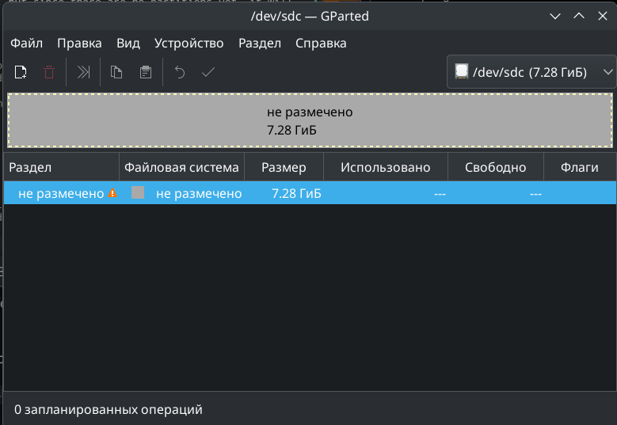

    Create the msdos partition table in Device->Create partition table. Agree to it saying that it'll erase all data. Now, create two partitions - first is 64mb, FAT32 fs, label "BOOT"; second takes the remaining disk, ext4 fs, label "ROOT". Apply changes to the disk with check button.

    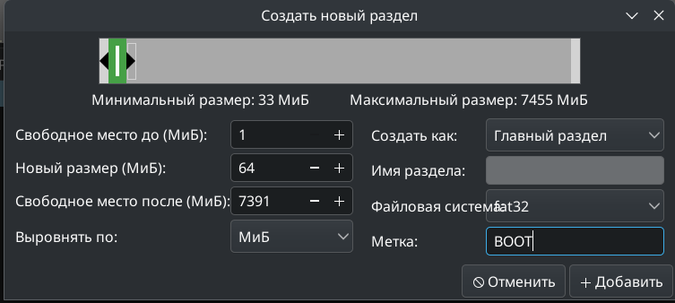
    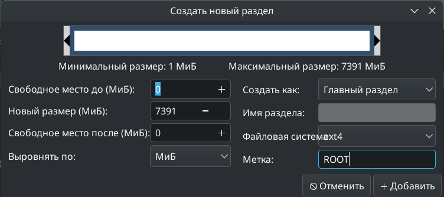
    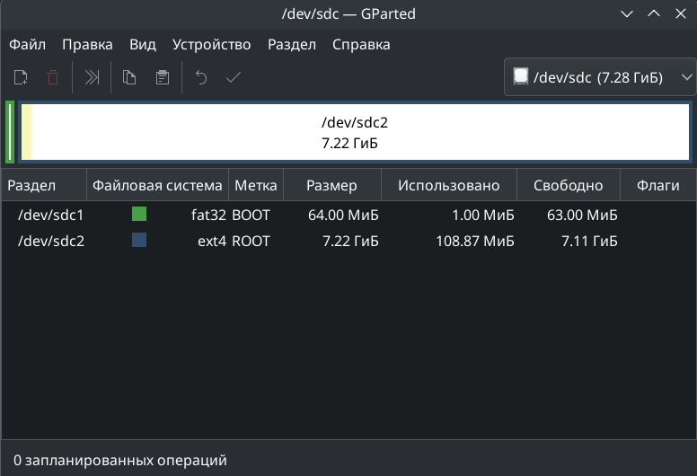

    After these operations, OS will recognize these partitions, and you will be able to mount them to work with the contents.

    First, mount the "BOOT" partition. It should be empty, obviously. Create folder "dtbo" in it. Copy "/PATH/TO/zynq_a9_mb/software/KERNEL/linux-xlnx/arch/arm/boot/zImage" to the partition. Copy the "/PATH/TO/zynq_a9_mb/software/BOOTLOADER/bootscript/boot.scr". Copy the FPGA bitstream from "/PATH/TO/zynq_a9_mb/software/BOOTLOADER/fpga_bs/PL.bin". In "dtbo" folder, create file "enabled.txt", that will contain list of dtb overlays to be enabled in the format of "enabled_dtbos=dtbo1.dtbo dtbo2.dtbo....". For example, "enabled_dtbos=hdmi_output.dtbo". Then, copy all dtb overlays you enabled and need to the same folder from "/PATH/TO/zynq_a9_mb/software/KERNEL/dtb-overlays/".

    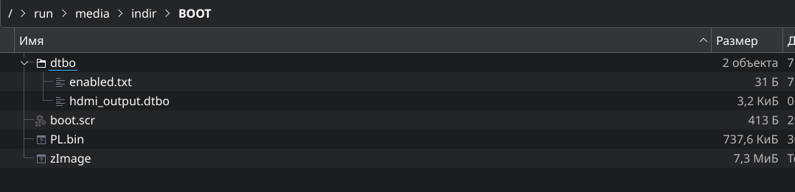

    Then, you can safely unmount "BOOT" partition and mount the next one, "ROOT". To upload the rootfs, go to "/PATH/TO/zynq_a9_mb/software/ROOTFS/", and run the "./decompress.sh /PATH/TO/ROOT/PARTITION/MOUNTPOINT". It needs root access to put the files with the correct permissions. Be careful to provide the correct path to the point where you mounted root partition, as with sudo it can write the files basically everywhere. It's gonna take some time to decompress the archive and write everything to the filesystem, you will see the progress as list of files it's already processed. After finishing, run "sync" for good measure to write all buffered data, and unmount the "ROOT" partition as well.

    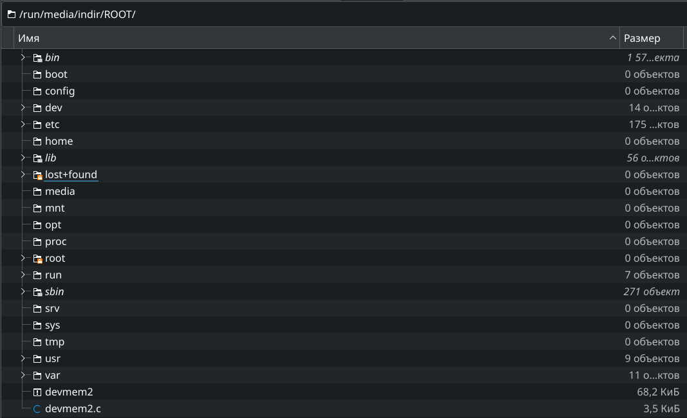

    Now, you can stop the UMS command in u-boot with CTRL+C, and reboot it with "reset" command. If everything's done correctly, you will see the u-boot automatically executing the bootscript, programming the FPGA, loading the DTB overlays and booting the linux kernel, which should finally bring up the Debian system, and give you a login prompt. The default login and password for shipped rootfs are root:root. Change them as soon as possible, if you want to expose this board to the internet. Also, by default there are SSH server and VNC server without password running in background. If you don't need VNC, you can switch it off with "systemctl stop x11vnc; systemctl disable x11vnc". If you don't need graphic subsystem at all, you can shut it down as well to save RAM, with "systemctl stop nodm; systemctl disable nodm". Also note that in default configuration, all log files are stored in RAM only using tmpfs, to prolong the eMMC life. If you don't need that, edit the /etc/fstab.

    Finally, you got fully working board that you can use for any of your projects!

    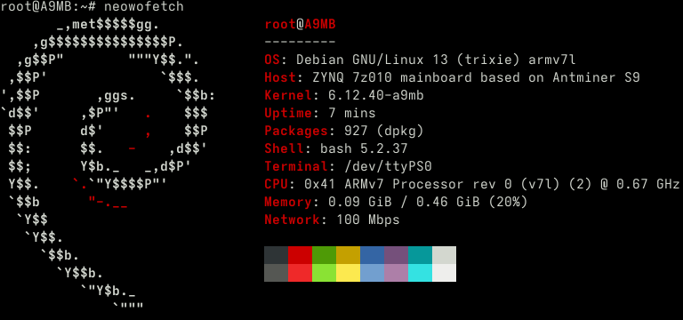
